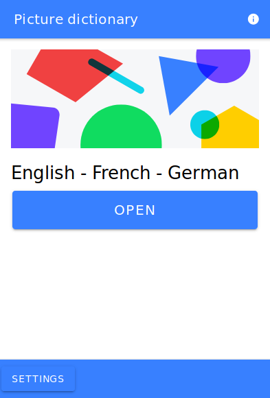
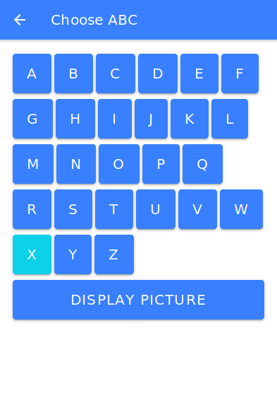
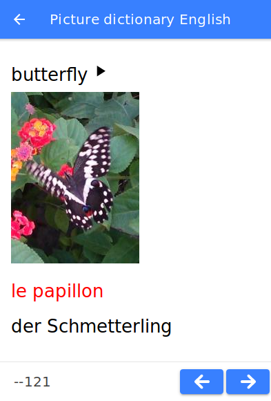
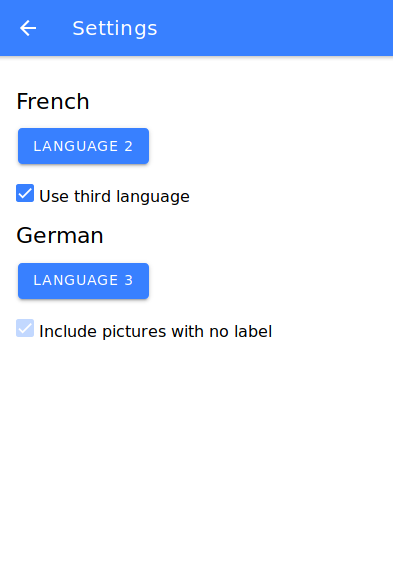
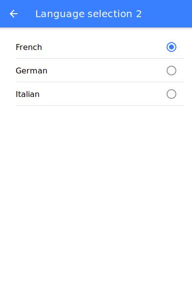
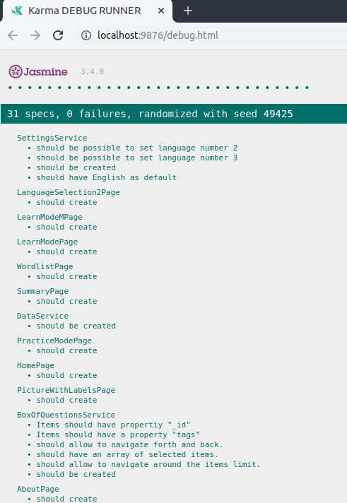
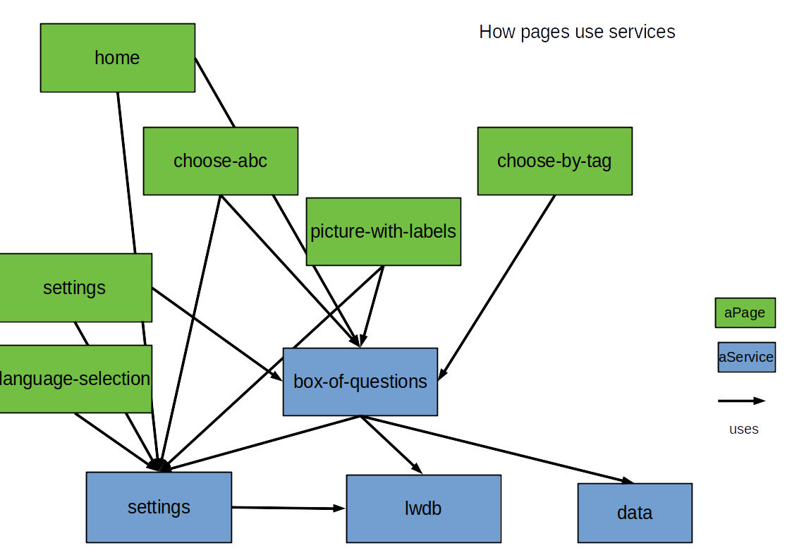

# Screen shots mobile phone app

## Home page


## Choose ABC page


## Picture with labels page


## Settings page


## Language selection page



# INSTALLATION OF TOOLS

Make sure the [Node.js and npm](https://nodejs.org/en/) are installed.

Then install ionic and cordova from the command line with:

    npm install -g ionic

    npm install -g cordova

This repository was developed with the following versions:

````
ionic info

Ionic:

   Ionic CLI                     : 5.2.0 (/usr/lib/node_modules/ionic)
   Ionic Framework               : @ionic/angular 4.11.5
   @angular-devkit/build-angular : 0.801.3
   @angular-devkit/schematics    : 8.1.3
   @angular/cli                  : 8.1.3
   @ionic/angular-toolkit        : 2.1.1

Utility:

   cordova-res : not installed
   native-run  : 0.2.9 

System:

   NodeJS : v10.17.0 (/usr/bin/node)
   npm    : 6.11.3
   OS     : Linux 4.15
````

# SETUP OF DEVELOPMENT AND TEST ENVIRONMENT FOR THE APPLICATION

Assuming git is installed

    git clone https://github.com/hhzl/ionic4-start-a7.git

    cd ionic5-start-a7

    npm install

    npm test

Otherwise download the file https://github.com/hhzl/ionic4-start-a7/archive/master.zip and unzip it. Then

    cd ionic4-start-a7

    npm install

    npm test

This shows the tests. 



See below how to run the app locally in a browser.


# RUN THE APP IN THE BROWSER
To run the application in a web browser execute on the command line

    ionic serve

Then use the indicated local web address such as http://localhost:8100 .


# HOW SCAFFOLDING WAS DONE

The scaffolding of the code in the repository was done with

````
ionic start ionic4-start-a7 blank --type=angular
cd ionic4-start-a7


ionic generate service services/BoxOfQuestions
ionic generate service services/LWdb
ionic generate service services/Data
ionic generate service services/Settings


ionic generate page pages/choose-mode
ionic generate page pages/choose-mode-m
ionic generate page pages/choose-abc
ionic generate page pages/choose-by-tag
ionic generate page pages/choose-by-tag-a
ionic generate page pages/choose-by-tag-f
ionic generate page pages/learn-mode
ionic generate page pages/learn-mode-m
ionic generate page pages/picture-with-labels
ionic generate page pages/practice-mode
ionic generate page pages/wordlist
ionic generate page pages/about
ionic generate page pages/settings
ionic generate page pages/languageSelection
ionic generate page pages/languageSelection2
ionic generate page pages/summary
ionic generate page pages/question4pictures


ionic cordova resources
 
````


The generated code is in the src directory and has to be configured. Such as for example changeing the header of the pages files (home page excluded) to

````
<ion-header>
  <ion-toolbar color="primary">
    <ion-title>...</ion-title>
    <ion-buttons slot="start">
      <ion-back-button></ion-back-button>
    </ion-buttons>
  </ion-toolbar>
</ion-header>
````

The header of the page home.page.html is

````
<ion-header>
    <ion-toolbar color="primary">
    <ion-buttons slot="end">
        <ion-button routerLink="/about">
            <ion-icon name="information-circle"></ion-icon>
        </ion-button>
    </ion-buttons>
    <ion-title>Ionic 4 start a7</ion-title>
    </ion-toolbar>
</ion-header>
````




## Adding Data

The pictures are in the directory src/assets/data/pictures.

The file 

    src/assets/data/csv/wordlist_en-ge.csv 

contains the labels for the pictures.

A service such as https://csvjson.com/csv2json is used to convert the label data into a JSON array.

The JSON array code has to be pasted into the file 

    src/app/services/data.service.ts.


## Note about testing

To make 'should create' tests work for pages
````
import { RouterTestingModule } from '@angular/router/testing';
````
has to be imported and then used in
````
imports: [IonicModule.forRoot(),RouterTestingModule]
````


# RUN THE APP ON THE DEVICE

   
## Android

Android environment setup: https://ionicframework.com/docs/installation/android, available for Windows, macOS and Linux.

Build apk file with

    ionic cordova run android


Android version numbers and API/SDK numbers
https://developer.android.com/guide/topics/manifest/uses-sdk-element
https://en.wikipedia.org/wiki/Android_version_history


